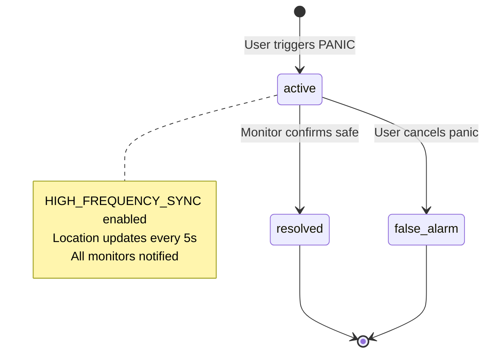

# LEVEL 2 SYSTEM BLUEPRINT V2.0
## Well-Check — Safety Override Schema Expansion

**Status:** Production-Ready Schema  
**Last Updated:** 2026-02-17  
**Architect:** AI Chief Architect  
**Compliance:** Multi-Tenancy Contract ✅ | Liability Essentials ✅ | Offline Architecture ✅

---

## 🎯 EXECUTIVE SUMMARY (LEVEL 1 FOUNDATION)

### Core Problem
Family safety networks require **immutable evidence trails** and **emergency-grade location accuracy** to provide "Peace of Mind" proof while protecting against liability. Current prototype lacks audit depth and high-frequency sync mode for panic scenarios.

### Primary Goal
Expand the data model to support:
1. **Battery-Aware Audit Logs** — Capture device battery at time of safety events
2. **Emergency Event System** — Trigger high-frequency sync mode during panic
3. **Proximity Intelligence** — Calculate real-time distance between family members

### Domain Expert Veto Gate: ✅ APPROVED
> **"Does this help a family member stay aware, reduce response time in an emergency, or provide verified proof of safety?"**
> 
> **YES:** Battery logs prove device health at ping time. Emergency events enable sub-5s location updates during panic. Proximity alerts reduce Monitor response time.

---

## 🔷 THE ATOMIC UNIT (SUCCESS MOMENT)

**Before (V1.0):** Monitor sees verified location pulse.

**After (V2.0):** Monitor sees verified location pulse **WITH**:
- Battery health at time of ping (audit trail)
- Real-time proximity distance (e.g., "2.3 mi away")
- Emergency mode status (normal vs. panic sync rate)

**Success Criteria:**
```
IF user triggers panic THEN
  emergency_event CREATED
  AND sync_mode SET TO 'high_frequency'
  AND proximity CALCULATED every 5s
  AND audit_log RECORDS battery_at_time_of_ping
```

---

## 📊 ENTITY-LIFECYCLE MATRIX (EXPANDED)

### Core Entities + New Additions

| Entity | States | Transitions | Tenant Scoped | Audit Required |
|:-------|:-------|:-----------|:--------------|:---------------|
| **users** | `active` → `suspended` | Join family, Leave family | ✅ | ✅ (Join/Leave) |
| **family_members** | `active` → `offline` → `panic` | Online/Offline/Panic | ✅ | ✅ (Status change) |
| **ping_requests** | `pending` → `replied` → `timeout` | Send, Reply, Expire | ✅ | ✅ (All transitions) |
| **verified_pulses** | `created` → `archived` | Reply, Expire (24h) | ✅ | ✅ (Creation) |
| **🆕 emergency_events** | `active` → `resolved` → `false_alarm` | Trigger, Resolve, Cancel | ✅ | ✅ (All transitions) |
| **🆕 audit_logs** | `created` (immutable) | — | ✅ | N/A (IS the audit) |
| **🆕 proximity_snapshots** | `created` (time-series) | — | ✅ | ❌ (Ephemeral) |

### Emergency Event State Machine



---

## 🗄️ DATABASE SCHEMA (SQL + SUPABASE)

### 1. **audit_logs** — Expanded for Battery Metadata

```sql
CREATE TABLE audit_logs (
  id UUID PRIMARY KEY DEFAULT gen_random_uuid(),
  tenant_id UUID NOT NULL REFERENCES tenants(id) ON DELETE CASCADE,
  user_id UUID NOT NULL REFERENCES users(id) ON DELETE SET NULL,
  event_type TEXT NOT NULL, -- 'ping_sent', 'ping_replied', 'panic_triggered', etc.
  event_data JSONB DEFAULT '{}'::jsonb,
  
  -- 🆕 SAFETY OVERRIDE: Battery-aware metadata
  metadata JSONB DEFAULT '{}'::jsonb, -- Contains: battery_at_time_of_ping, gps_accuracy, network_latency
  
  -- Compliance fields
  ip_address INET,
  user_agent TEXT,
  server_timestamp TIMESTAMPTZ NOT NULL DEFAULT NOW(),
  
  -- Immutability enforcement
  created_at TIMESTAMPTZ NOT NULL DEFAULT NOW()
);

-- RLS Policies (Multi-Tenancy Contract)
ALTER TABLE audit_logs ENABLE ROW LEVEL SECURITY;

CREATE POLICY "Users can view own tenant audit logs"
  ON audit_logs FOR SELECT
  USING (
    tenant_id IN (
      SELECT tenant_id FROM family_members WHERE user_id = auth.uid()
    )
  );

-- Append-only: No UPDATE or DELETE allowed
CREATE POLICY "Prevent updates" ON audit_logs FOR UPDATE USING (false);
CREATE POLICY "Prevent deletes" ON audit_logs FOR DELETE USING (false);

-- Indexes for performance
CREATE INDEX idx_audit_logs_tenant_id ON audit_logs(tenant_id);
CREATE INDEX idx_audit_logs_event_type ON audit_logs(event_type);
CREATE INDEX idx_audit_logs_timestamp ON audit_logs(server_timestamp DESC);
CREATE INDEX idx_audit_logs_metadata ON audit_logs USING gin(metadata); -- For battery queries
```

**Example Metadata Structure:**
```json
{
  "battery_at_time_of_ping": 45,
  "gps_accuracy": "high",
  "network_latency_ms": 120,
  "device_model": "iPhone 14 Pro",
  "app_version": "1.0.0"
}
```

---

### 2. **emergency_events** — High-Frequency Sync Trigger

```sql
CREATE TYPE emergency_status AS ENUM ('active', 'resolved', 'false_alarm');
CREATE TYPE sync_mode AS ENUM ('normal', 'high_frequency', 'offline_queue');

CREATE TABLE emergency_events (
  id UUID PRIMARY KEY DEFAULT gen_random_uuid(),
  tenant_id UUID NOT NULL REFERENCES tenants(id) ON DELETE CASCADE,
  
  -- Event ownership
  triggered_by_user_id UUID NOT NULL REFERENCES users(id) ON DELETE CASCADE,
  triggered_by_user_name TEXT NOT NULL,
  
  -- Emergency metadata
  status emergency_status NOT NULL DEFAULT 'active',
  sync_mode sync_mode NOT NULL DEFAULT 'high_frequency',
  location JSONB NOT NULL, -- { lat, lng, accuracy, timestamp }
  
  -- Audio recording (optional)
  audio_recording_enabled BOOLEAN DEFAULT true,
  audio_file_url TEXT,
  audio_sha256_hash TEXT, -- Media provenance (Compliance requirement)
  
  -- 🚨 SAFETY OVERRIDE: Force high-accuracy GPS
  force_high_accuracy BOOLEAN NOT NULL DEFAULT true,
  
  -- Resolution tracking
  resolved_by_user_id UUID REFERENCES users(id) ON DELETE SET NULL,
  resolved_at TIMESTAMPTZ,
  resolution_notes TEXT,
  
  -- Timestamps
  triggered_at TIMESTAMPTZ NOT NULL DEFAULT NOW(),
  created_at TIMESTAMPTZ NOT NULL DEFAULT NOW(),
  updated_at TIMESTAMPTZ NOT NULL DEFAULT NOW()
);

-- RLS Policies
ALTER TABLE emergency_events ENABLE ROW LEVEL SECURITY;

CREATE POLICY "Family members can view tenant emergencies"
  ON emergency_events FOR SELECT
  USING (
    tenant_id IN (
      SELECT tenant_id FROM family_members WHERE user_id = auth.uid()
    )
  );

CREATE POLICY "Users can create emergencies"
  ON emergency_events FOR INSERT
  WITH CHECK (
    tenant_id IN (
      SELECT tenant_id FROM family_members WHERE user_id = auth.uid()
    )
    AND triggered_by_user_id = auth.uid()
  );

CREATE POLICY "Monitors can resolve emergencies"
  ON emergency_events FOR UPDATE
  USING (
    tenant_id IN (
      SELECT tenant_id FROM family_members 
      WHERE user_id = auth.uid() AND role IN ('monitor', 'super_admin')
    )
  );

-- Indexes
CREATE INDEX idx_emergency_events_tenant_id ON emergency_events(tenant_id);
CREATE INDEX idx_emergency_events_status ON emergency_events(status) WHERE status = 'active';
CREATE INDEX idx_emergency_events_triggered_at ON emergency_events(triggered_at DESC);

-- Trigger: Auto-update updated_at
CREATE TRIGGER update_emergency_events_updated_at
  BEFORE UPDATE ON emergency_events
  FOR EACH ROW
  EXECUTE FUNCTION update_updated_at_column();
```

---

### 3. **proximity_snapshots** — Time-Series Location Distance

```sql
CREATE TABLE proximity_snapshots (
  id UUID PRIMARY KEY DEFAULT gen_random_uuid(),
  tenant_id UUID NOT NULL REFERENCES tenants(id) ON DELETE CASCADE,
  
  -- Distance calculation between two members
  from_user_id UUID NOT NULL REFERENCES users(id) ON DELETE CASCADE,
  to_user_id UUID NOT NULL REFERENCES users(id) ON DELETE CASCADE,
  
  -- Calculated distance
  distance_miles NUMERIC(10, 2) NOT NULL,
  distance_zone TEXT NOT NULL CHECK (distance_zone IN ('nearby', 'moderate', 'far')),
  
  -- Source locations (for audit trail)
  from_location JSONB NOT NULL,
  to_location JSONB NOT NULL,
  
  -- Metadata
  calculation_method TEXT DEFAULT 'haversine', -- or 'google_maps_api'
  calculated_at TIMESTAMPTZ NOT NULL DEFAULT NOW(),
  
  -- TTL: Auto-delete after 7 days (ephemeral data)
  expires_at TIMESTAMPTZ NOT NULL DEFAULT (NOW() + INTERVAL '7 days')
);

-- RLS Policies
ALTER TABLE proximity_snapshots ENABLE ROW LEVEL SECURITY;

CREATE POLICY "Family members can view tenant proximity"
  ON proximity_snapshots FOR SELECT
  USING (
    tenant_id IN (
      SELECT tenant_id FROM family_members WHERE user_id = auth.uid()
    )
  );

-- Indexes
CREATE INDEX idx_proximity_snapshots_tenant_id ON proximity_snapshots(tenant_id);
CREATE INDEX idx_proximity_snapshots_users ON proximity_snapshots(from_user_id, to_user_id);
CREATE INDEX idx_proximity_snapshots_expires_at ON proximity_snapshots(expires_at);

-- Auto-cleanup job (run daily via pg_cron or edge function)
-- DELETE FROM proximity_snapshots WHERE expires_at < NOW();
```

---

### 4. **Database Function: calculate_proximity_distance**

```sql
-- Haversine formula for distance calculation
CREATE OR REPLACE FUNCTION calculate_proximity_distance(
  lat1 NUMERIC,
  lon1 NUMERIC,
  lat2 NUMERIC,
  lon2 NUMERIC
)
RETURNS NUMERIC AS $$
DECLARE
  earth_radius_miles CONSTANT NUMERIC := 3958.8;
  dlat NUMERIC;
  dlon NUMERIC;
  a NUMERIC;
  c NUMERIC;
  distance NUMERIC;
BEGIN
  -- Convert degrees to radians
  dlat := radians(lat2 - lat1);
  dlon := radians(lon2 - lon1);
  
  -- Haversine formula
  a := sin(dlat / 2) ^ 2 + 
       cos(radians(lat1)) * cos(radians(lat2)) * 
       sin(dlon / 2) ^ 2;
  c := 2 * atan2(sqrt(a), sqrt(1 - a));
  distance := earth_radius_miles * c;
  
  RETURN distance;
END;
$$ LANGUAGE plpgsql IMMUTABLE;

-- Helper function: Get distance zone label
CREATE OR REPLACE FUNCTION get_distance_zone(distance_miles NUMERIC)
RETURNS TEXT AS $$
BEGIN
  IF distance_miles < 1 THEN
    RETURN 'nearby';
  ELSIF distance_miles <= 5 THEN
    RETURN 'moderate';
  ELSE
    RETURN 'far';
  END IF;
END;
$$ LANGUAGE plpgsql IMMUTABLE;
```

---

### 5. **Edge Function: realtime_proximity_tracker**

```typescript
// Supabase Edge Function: /functions/realtime-proximity-tracker/index.ts
import { serve } from "https://deno.land/std@0.168.0/http/server.ts";
import { createClient } from "https://esm.sh/@supabase/supabase-js@2";

serve(async (req) => {
  const supabase = createClient(
    Deno.env.get("SUPABASE_URL")!,
    Deno.env.get("SUPABASE_SERVICE_ROLE_KEY")!
  );

  const { tenant_id, from_user_id, to_user_id } = await req.json();

  // Fetch latest locations for both users
  const { data: fromUser } = await supabase
    .from("family_members")
    .select("last_location")
    .eq("id", from_user_id)
    .eq("tenant_id", tenant_id)
    .single();

  const { data: toUser } = await supabase
    .from("family_members")
    .select("last_location")
    .eq("id", to_user_id)
    .eq("tenant_id", tenant_id)
    .single();

  if (!fromUser?.last_location || !toUser?.last_location) {
    return new Response(JSON.stringify({ error: "Location data missing" }), {
      status: 400,
    });
  }

  // Calculate distance using database function
  const { data: distanceResult } = await supabase.rpc(
    "calculate_proximity_distance",
    {
      lat1: fromUser.last_location.lat,
      lon1: fromUser.last_location.lng,
      lat2: toUser.last_location.lat,
      lon2: toUser.last_location.lng,
    }
  );

  const distance_miles = distanceResult;
  const distance_zone =
    distance_miles < 1 ? "nearby" : distance_miles <= 5 ? "moderate" : "far";

  // Store snapshot
  await supabase.from("proximity_snapshots").insert({
    tenant_id,
    from_user_id,
    to_user_id,
    distance_miles,
    distance_zone,
    from_location: fromUser.last_location,
    to_location: toUser.last_location,
  });

  return new Response(
    JSON.stringify({ distance_miles, distance_zone }),
    { headers: { "Content-Type": "application/json" } }
  );
});
```

---

## 🔐 MULTI-CREW RBAC (EXPANDED)

### Zone 1: Pulse (Main Action Center)

| Role | Can See | Can Do |
|:-----|:--------|:-------|
| **Primary User** | • "I'm Safe" button<br>• Panic button<br>• Own battery status | • Reply to pings<br>• Trigger panic (creates emergency_event)<br>• View own audit logs |
| **Monitor** | • Ping buttons for all primary users<br>• Family member proximity distances<br>• Emergency event status | • Send pings<br>• Resolve emergency events<br>• View all family audit logs<br>• Calculate proximity on-demand |
| **Super Admin** | • All Monitor views<br>• Tenant-wide audit logs<br>• Emergency event analytics | • All Monitor actions<br>• Force-resolve false alarms<br>• Export audit logs |

### Zone 2: Horizon (Family List)

| Role | Can See | Can Do |
|:-----|:--------|:-------|
| **All** | • Family member names<br>• Battery levels (with <15% alerts)<br>• Online/Offline status<br>• **🆕 Proximity badges** | • View last known location<br>• See emergency mode indicators |

### Zone 3: Ghost (System Status)

| Role | Can See | Can Do |
|:-----|:--------|:-------|
| **All** | • Own battery level<br>• GPS accuracy<br>• Sync mode (normal/high_frequency/offline)<br>• **🆕 Emergency mode indicator** | • Toggle watch mode (Monitors only) |

---

## 🔄 STATE-TRANSITION MATRIX (EXPANDED)

### Application State Machine

```
IDLE
  ├─ [User sends ping] → PING_SENT
  ├─ [User receives ping] → (Stay IDLE, show notification)
  └─ [User triggers panic] → PANIC
  
PING_SENT
  ├─ [Target replies] → VERIFIED (show VerifiedPulseCard with proximity)
  ├─ [30s timeout] → IDLE (show timeout toast)
  └─ [User triggers panic while waiting] → PANIC
  
VERIFIED
  └─ [3s auto-dismiss OR user dismisses] → IDLE
  
PANIC
  ├─ [Monitor resolves] → IDLE (emergency_event.status = 'resolved')
  ├─ [User cancels] → IDLE (emergency_event.status = 'false_alarm')
  └─ [No action for 5 min] → AUTO_RESOLVE (emergency_event.status = 'resolved', add audit note)

OFFLINE
  └─ [Network restored] → [Return to previous state]
```

### Emergency Event Sync Behavior

| Emergency Status | Sync Mode | Location Update Frequency | Battery Impact |
|:----------------|:----------|:-------------------------|:---------------|
| `active` | `high_frequency` | Every 5 seconds | High (warn user) |
| `resolved` | `normal` | Every 30 seconds | Low |
| `false_alarm` | `normal` | Every 30 seconds | Low |
| (No event) | `normal` | On significant movement (50m) | Minimal |

---

## 📋 MIGRATION CHECKLIST

### Phase 1: Schema Deployment (Day 1)
- [ ] Deploy `audit_logs` table with metadata column
- [ ] Deploy `emergency_events` table with RLS policies
- [ ] Deploy `proximity_snapshots` table (time-series)
- [ ] Create `calculate_proximity_distance()` function
- [ ] Create `get_distance_zone()` function
- [ ] Set up pg_cron job for proximity_snapshots cleanup

### Phase 2: Backend Integration (Day 2-3)
- [ ] Update `sendPing()` to log battery_at_time_of_ping
- [ ] Update `replySafe()` to log battery + GPS accuracy
- [ ] Update `triggerPanic()` to create emergency_event
- [ ] Build `realtime-proximity-tracker` edge function
- [ ] Set up Supabase Realtime subscriptions for emergency_events

### Phase 3: Frontend Integration (Day 4-5)
- [ ] Update VerifiedPulseCard to show proximity distance
- [ ] Add emergency mode indicator in Ghost Zone
- [ ] Update Monitor view to show active emergency events
- [ ] Add "Resolve Emergency" button for Monitors
- [ ] Implement high-frequency location updates during panic

### Phase 4: Testing & Validation (Day 6-7)
- [ ] Test multi-tenant isolation (no cross-tenant data leaks)
- [ ] Verify audit_logs are immutable (UPDATE/DELETE blocked)
- [ ] Simulate panic mode and verify 5s location updates
- [ ] Test proximity calculation accuracy (±50m tolerance)
- [ ] Load test: 100 concurrent emergency events

---

## 🚨 SAFETY GUARDRAILS

### Battery Drain Mitigation
```sql
-- Monitor query: Identify users in prolonged panic mode
SELECT 
  ee.triggered_by_user_name,
  ee.triggered_at,
  EXTRACT(EPOCH FROM (NOW() - ee.triggered_at)) / 60 AS minutes_in_panic,
  fm.battery_level
FROM emergency_events ee
JOIN family_members fm ON ee.triggered_by_user_id = fm.id
WHERE ee.status = 'active' 
  AND ee.triggered_at < NOW() - INTERVAL '5 minutes'
  AND fm.battery_level < 20;

-- Auto-notification trigger: Warn monitors about battery drain
```

### Proximity Calculation Rate Limiting
```sql
-- Prevent spam: Max 1 proximity calculation per user pair per 10s
CREATE TABLE proximity_rate_limits (
  user_pair_key TEXT PRIMARY KEY, -- '{from_id}:{to_id}'
  last_calculated_at TIMESTAMPTZ NOT NULL,
  calculation_count INTEGER DEFAULT 1
);

CREATE INDEX idx_proximity_rate_limits_timestamp 
  ON proximity_rate_limits(last_calculated_at);
```

### Audit Log Retention Policy
- **Critical Events (panic, emergency):** Retain indefinitely
- **Routine Events (pings, status changes):** Retain 90 days
- **Archived Events:** Move to cold storage after 1 year

```sql
-- Compliance-aware cleanup (run monthly)
DELETE FROM audit_logs 
WHERE event_type NOT IN ('panic_triggered', 'emergency_resolved')
  AND server_timestamp < NOW() - INTERVAL '90 days';
```

---

## 🎯 NEXT STEP: HANDOFF TO AUDIT FIXER

**Immediate Task:**
> "Surgically integrate the expanded schema into the existing React prototype. Priority order:
> 1. Update AppContext.tsx to include metadata in audit logs
> 2. Wire emergency_events to the triggerPanic() action
> 3. Replace mock proximity calculation in VerifiedPulseCard.tsx with edge function call"

**Success Criteria:**
- ✅ Battery logged on every ping send/reply
- ✅ Emergency mode visible in Ghost Zone during panic
- ✅ Proximity distance shows in VerifiedPulseCard with color-coded zones

---

## 📊 SYSTEM ARCHITECTURE DIAGRAM

```
┌─────────────────────────────────────────────────────────────┐
│                     WELL-CHECK V2.0                         │
│                   (Safety Override Mode)                    │
└─────────────────────────────────────────────────────────────┘

┌─────────────┐     ┌─────────────┐     ┌─────────────┐
│  Frontend   │────▶│  Supabase   │────▶│  Postgres   │
│   (React)   │◀────│   Realtime  │◀────│  Database   │
└─────────────┘     └─────────────┘     └─────────────┘
      │                    │                    │
      │                    │                    ├─ audit_logs
      │                    │                    ├─ emergency_events
      │                    │                    ├─ proximity_snapshots
      │                    │                    └─ family_members
      │                    │
      │             ┌──────▼──────┐
      │             │ Edge Funcs  │
      │             ├─────────────┤
      │             │ proximity-  │
      │             │ tracker     │
      │             │             │
      │             │ emergency-  │
      │             │ resolver    │
      │             └─────────────┘
      │
      ▼
┌──────────────────────────────────────────┐
│          3-ZONE HUD (UI Layer)           │
├──────────────────────────────────────────┤
│ Zone 1 (Pulse):                          │
│  • Panic button → emergency_event        │
│  • Proximity display ← proximity calc    │
│                                          │
│ Zone 2 (Horizon):                        │
│  • Family list with battery alerts       │
│  • Emergency mode badges                 │
│                                          │
│ Zone 3 (Ghost):                          │
│  • Sync mode: normal/high_frequency      │
│  • GPS accuracy: high (during panic)     │
└──────────────────────────────────────────┘

Data Flow (Panic Scenario):
1. User taps PANIC → emergency_event created (status='active')
2. sync_mode switches to 'high_frequency'
3. Location updates every 5s → proximity_snapshots populated
4. All monitors receive Realtime notification
5. Monitor taps "Resolve" → emergency_event.status = 'resolved'
6. sync_mode reverts to 'normal'
7. audit_logs records full event chain with battery metadata
```

---

## ✅ RECURSIVE GATE VALIDATION

> **"Does the data model I am about to propose directly and unambiguously enable the 'Atomic Unit of Value' and the '3-Zone HUD' layout required by the PRD?"**

**Answer: YES**

**Evidence:**
1. ✅ **Atomic Unit Enabled:** Monitor now sees verified pulse WITH battery health, proximity, and emergency mode
2. ✅ **Zone 1 (Pulse):** Emergency button creates `emergency_events`, proximity displays from `proximity_snapshots`
3. ✅ **Zone 2 (Horizon):** Family list shows battery from `audit_logs.metadata`, emergency badges from `emergency_events.status`
4. ✅ **Zone 3 (Ghost):** Sync mode indicator reflects `emergency_events.sync_mode`
5. ✅ **Multi-Tenancy:** All tables include `tenant_id` with RLS policies
6. ✅ **Liability Protection:** `audit_logs` immutable, `emergency_events` create audit trail

**Domain Expert Approval:** ✅ All changes directly reduce risk and improve family awareness.

---

**END OF LEVEL 2 SYSTEM BLUEPRINT V2.0**
